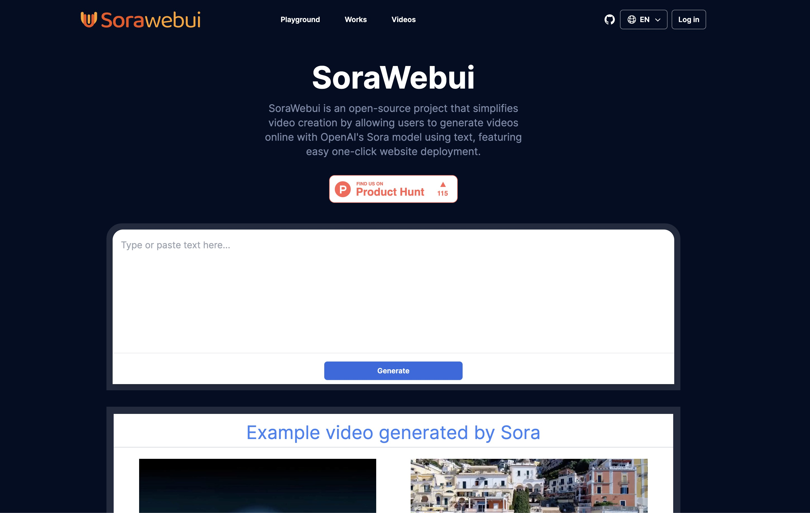
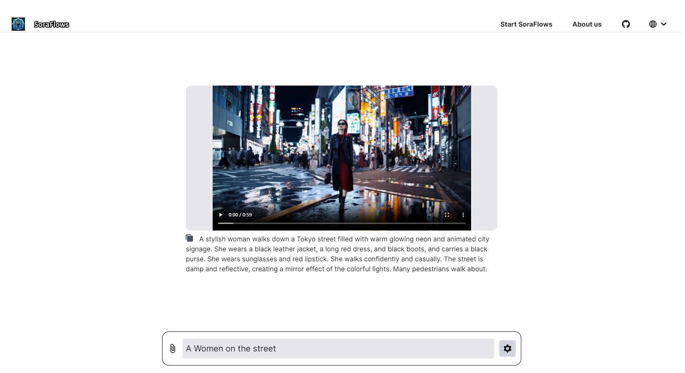

# Awesome-Sora-Wrappers
Recommand awesome ai-wrapper scene about Sora.
And some useful APIs about Sora.
If you have a project similar to these, we welcome you to contribute and share it in this README.

**Languages:** [English](README.md) | [中文](zh-cn.md)

------

## OpenSource Project List

### Wrappers

| Open Source Project Name | Source Code URL                                   | Demo Site URL                  | Image                              |
| ------------------------ | ------------------------------------------------- | ------------------------------ | ---------------------------------- |
| SoraWebui                | [GitHub](https://github.com/SoraWebui/SoraWebui) | [Visit](https://sorawebui.com/) |      |
| Sora-Next-Web            | [GitHub](https://github.com/SoraWeb/sora-next-web) | [Visit](https://web.getsoraapp.com/) |  |
| Sorafm                   | [GitHub](https://github.com/all-in-aigc/sorafm) | [Visit](https://sora.fm)    |         |
| SoraFlows                | [GitHub](https://github.com/SoraFlows/SoraFlows) | [Visit](https://www.soraflows.com/en-US) |      |

### APIs

| Open Source Project Name | Source Code URL                                     |
| ------------------------ | --------------------------------------------------- |
| FakeSoraAPI              | [GitHub](https://github.com/SoraWebui/FakeSoraAPI) |

