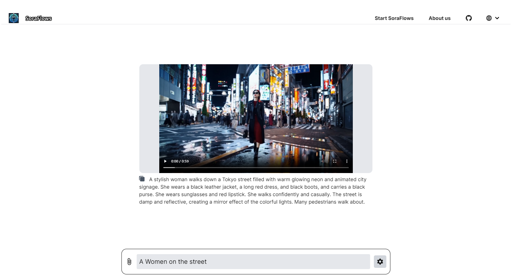

# 优质Sora项目推荐
该Readme主要收录Sora相关项目。期望能帮助更多专注于做Sora项目的朋友曝光，并为其他准备做Sora项目的工程师提供相关产品参考。
Readme收录包括各类Sora场景的开源/闭源项目，套壳站，APIs，以及相关工具。
如果您也有类似的项目，可以贡献提交至该Readme。

## 项目列表
**语言版本：** [English](README.md) | [中文](zh-cn.md)

### Opensource Wrappers（开源套壳站）

| 开源项目名称     | 开源代码地址                                   | 演示网站地址                  | 示例图片                              |
| -------------- | ------------------------------------------ | -------------------------- | ---------------------------------- |
| SoraWebui      | [GitHub](https://github.com/SoraWebui/SoraWebui) | [访问](https://sorawebui.com/) |      |
| Sora-Next-Web  | [GitHub](https://github.com/SoraWeb/sora-next-web) | [访问](https://web.getsoraapp.com/) |  |
| Sorafm         | [GitHub](https://github.com/all-in-aigc/sorafm) | [访问](https://sora.fm)    |         |
| SoraFlows      | [GitHub](https://github.com/SoraFlows/SoraFlows) | [访问](https://www.soraflows.com/en-US) |      |

### APIs（APIs）

| 开源项目名称   | 开源代码地址                                     |
| ------------ | -------------------------------------------- |
| FakeSoraAPI  | [GitHub](https://github.com/SoraWebui/FakeSoraAPI) |
